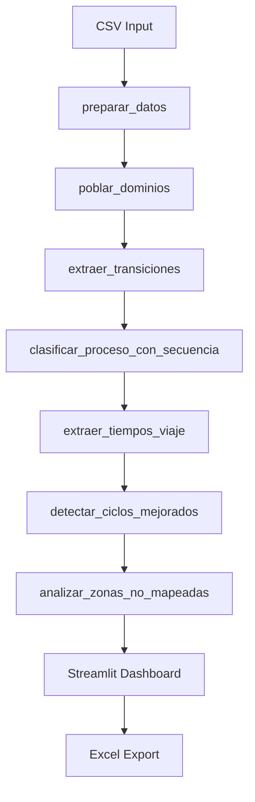

# 🔧 T-Metal BI - Documentación para Desarrolladores

## 🏗️ Arquitectura del Sistema

### 📁 **Estructura de Archivos**

```
Prototipo-App-Streamlit-T-metal-Geo-Austral-1/
├── 📱 app6_mejorado.py          # Aplicación principal (ACTUAL)
├── 📱 app5.py                   # Versión anterior
├── 📱 app6.py                   # Desarrollo intermedio
├── 📋 requirements.txt          # Dependencias Python
├── 📊 csv de prueba.csv         # Datos de prueba
├── 📚 GUIA_USUARIO_COMPLETA.md  # Guía del usuario
├── 📚 DOCUMENTACION_TECNICA.md  # Documentación técnica original
├── 📚 DOCUMENTACION_DESARROLLADOR.md # Esta documentación
├── 📚 ESPECIFICACION_INPUT.md   # Especificación de entrada
├── 📚 README.md                 # Documentación general
├── 📚 CHANGELOG.md              # Historial de cambios
├── 📚 CHECKLIST_PRUEBAS.md      # Lista de verificación
└── 📚 deployment_guide.md       # Guía de despliegue
```

### 🧩 **Componentes Principales**

#### **1. Procesamiento de Datos**
```python
def preparar_datos(df: pd.DataFrame) -> pd.DataFrame
def poblar_dominios(df: pd.DataFrame) -> None
def extraer_transiciones(df: pd.DataFrame) -> pd.DataFrame
def clasificar_proceso_con_secuencia(df: pd.DataFrame) -> pd.DataFrame
```

#### **2. Análisis Temporal**
```python
def extraer_tiempos_viaje(df: pd.DataFrame) -> tuple
def construir_metricas_viaje(viajes_df: pd.DataFrame) -> pd.DataFrame
def detectar_ciclos_mejorados(trans: pd.DataFrame) -> pd.DataFrame
```

#### **3. Análisis Espacial**
```python
def analizar_zonas_no_mapeadas(df: pd.DataFrame, ...) -> pd.DataFrame
def agrupar_zonas_cercanas(zonas_df: pd.DataFrame, ...) -> pd.DataFrame
def crear_mapa_calor(df: pd.DataFrame, zonas: pd.DataFrame) -> folium.Map
```

#### **4. Interfaz de Usuario**
```python
# Streamlit components
st.set_page_config()
st.file_uploader()
st.sidebar.selectbox()
st_folium()  # Mapas interactivos
```

## 🔄 Flujo de Procesamiento

### 📊 **Pipeline de Datos**



### 🔧 **Funciones Core Detalladas**

#### **1. `preparar_datos(df: pd.DataFrame) -> pd.DataFrame`**

```python
def preparar_datos(df: pd.DataFrame) -> pd.DataFrame:
    """
    Prepara y limpia los datos de entrada.
    
    Transformaciones:
    - Convierte 'Tiempo de evento' a datetime
    - Normaliza columna 'Geocercas' 
    - Convierte coordenadas a numérico
    - Añade columna 'Turno' (día/noche)
    - Ordena por vehículo y tiempo
    """
    # Conversión de tipos
    df["Tiempo de evento"] = pd.to_datetime(df["Tiempo de evento"])
    df["Geocercas"] = df["Geocercas"].fillna("").astype(str)
    
    # Cálculo de turnos
    df["Turno"] = df["Tiempo de evento"].apply(turno)
    
    return df.sort_values(["Nombre del Vehículo", "Tiempo de evento"])
```

#### **2. `poblar_dominios(df: pd.DataFrame) -> None`**

```python
def poblar_dominios(df: pd.DataFrame) -> None:
    """
    Detecta automáticamente tipos de geocercas usando patrones.
    
    Patrones de detección:
    - STOCKS: contiene "stock"
    - MODULES: contiene "modulo" o "módulo"
    - PILAS_ROM: contiene "pila" y "rom"
    - BOTADEROS: contiene "botadero"
    - INSTALACIONES_FAENA: contiene "instalacion" o "faena"
    - CASINO: contiene "casino"
    
    Almacena resultados en variables globales.
    """
    geos = set(df["Geocercas"].unique()) - {""}
    
    # Detección por patrones
    STOCKS = {g for g in geos if "stock" in normalizar(g)}
    MODULES = {g for g in geos if "modulo" in normalizar(g)}
    # ... más patrones
    
    # Agrupación lógica
    GEOCERCAS_NO_OPERACIONALES = INSTALACIONES_FAENA | CASINO
    
    # Almacenamiento global
    globals()["STOCKS"] = STOCKS
    # ... más variables
```

#### **3. `extraer_transiciones(df: pd.DataFrame) -> pd.DataFrame`**

```python
def extraer_transiciones(df: pd.DataFrame) -> pd.DataFrame:
    """
    Detecta transiciones completas entre geocercas con filtrado inteligente.
    
    Algoritmo:
    1. Identifica "permanencias reales" (>60s) vs ruido GPS
    2. Reconstruye transiciones completas: Geocerca1 → Geocerca2
    3. Calcula duraciones y tiempos de entrada/salida
    4. Filtra por tiempo mínimo de estancia
    
    Casos manejados:
    - Geocerca → [VIAJE] → Geocerca (reconstruye como directa)
    - Permanencias cortas (filtradas como ruido GPS)
    - Múltiples registros consecutivos en misma geocerca
    """
    UMBRAL_PERMANENCIA_REAL = 60  # segundos
    
    # Procesamiento por vehículo
    for veh, grupo in df.groupby("Nombre del Vehículo"):
        # 1. Identificar permanencias reales
        permanencias_reales = []
        # ... lógica de filtrado GPS
        
        # 2. Reconstruir transiciones
        transiciones = []
        # ... lógica de reconstrucción
    
    return pd.DataFrame(transiciones)
```

#### **4. `clasificar_proceso_con_secuencia(df: pd.DataFrame) -> pd.DataFrame`**

```python
def clasificar_proceso_con_secuencia(df: pd.DataFrame) -> pd.DataFrame:
    """
    Clasifica procesos usando contexto de secuencia.
    
    Jerarquía de clasificación:
    1. PRIORIDAD ALTA: Geocercas no operacionales → "otro"
    2. Procesos operacionales básicos (carga, descarga)
    3. Retornos con contexto de secuencia
    4. Por defecto: "otro"
    
    Algoritmo por vehículo:
    - Ordena transiciones cronológicamente
    - Evalúa cada transición con contexto del proceso anterior
    - Aplica reglas de clasificación jerárquicas
    """
    # Obtener dominios globales
    GEOCERCAS_NO_OPERACIONALES = globals().get("GEOCERCAS_NO_OPERACIONALES", set())
    
    # Procesar por vehículo para mantener secuencia
    for veh, grupo in df.groupby("Nombre del Vehículo"):
        for i in range(len(grupo)):
            origen = grupo.loc[i, "Origen"]
            destino = grupo.loc[i, "Destino"]
            proceso_anterior = grupo.loc[i-1, "Proceso"] if i > 0 else None
            
            # Aplicar reglas de clasificación
            if origen in GEOCERCAS_NO_OPERACIONALES or destino in GEOCERCAS_NO_OPERACIONALES:
                grupo.loc[i, "Proceso"] = "otro"
            # ... más reglas
    
    return df
```

## 🗺️ Análisis Espacial Avanzado

### 🔍 **Detección de Zonas No Mapeadas**

#### **Algoritmo Principal**

```python
def analizar_zonas_no_mapeadas(df: pd.DataFrame, 
                              velocidad_max: float = 5.0,
                              tiempo_min_minutos: int = 10,
                              radio_agrupacion: float = 10.0) -> pd.DataFrame:
    """
    Identifica zonas operacionales no mapeadas usando análisis espacial.
    
    Fases del algoritmo:
    1. Filtrado inicial: registros fuera de geocercas + baja velocidad
    2. Agrupación temporal: permanencias consecutivas
    3. Filtrado por duración mínima
    4. Clustering espacial con DBSCAN
    5. Cálculo de métricas por zona
    """
    
    # Fase 1: Filtrado inicial
    fuera_geocercas = df[df["Geocercas"] == ""]
    baja_velocidad = fuera_geocercas[
        (fuera_geocercas["Velocidad [km/h]"].isna()) | 
        (fuera_geocercas["Velocidad [km/h]"] <= velocidad_max)
    ]
    
    # Fase 2: Agrupación temporal por vehículo
    for veh, grupo in baja_velocidad.groupby("Nombre del Vehículo"):
        grupo["tiempo_diff"] = grupo["Tiempo de evento"].diff().dt.total_seconds()
        grupo["nuevo_grupo"] = (grupo["tiempo_diff"] > 300).cumsum()  # 5 min separación
        
        # Fase 3: Filtrado por duración
        for grupo_id, subgrupo in grupo.groupby("nuevo_grupo"):
            duracion_minutos = (subgrupo["Tiempo de evento"].max() - 
                              subgrupo["Tiempo de evento"].min()).total_seconds() / 60
            
            if duracion_minutos >= tiempo_min_minutos:
                # Registrar zona candidata
                zonas_candidatas.append({...})
    
    # Fase 4: Clustering espacial
    zonas_agrupadas = agrupar_zonas_cercanas(zonas_df, radio_agrupacion)
    
    return zonas_agrupadas
```

#### **Clustering con DBSCAN**

```python
def agrupar_zonas_cercanas(zonas_df: pd.DataFrame, 
                          radio_metros: float = 10.0) -> pd.DataFrame:
    """
    Agrupa zonas cercanas usando clustering DBSCAN con distancia Haversine.
    
    Parámetros:
    - eps: radio en grados (convertido de metros)
    - min_samples: 1 (no queremos ruido)
    - metric: 'haversine' (distancia esférica precisa)
    
    Salida:
    - Zonas individuales: mantiene datos originales
    - Zonas agrupadas: centro ponderado, métricas combinadas
    """
    from sklearn.cluster import DBSCAN
    import numpy as np
    
    # Conversión metros → grados (aproximada)
    radio_grados = radio_metros / 111000
    
    # Clustering
    coordenadas = zonas_df[["Latitud_Centro", "Longitud_Centro"]].values
    clustering = DBSCAN(eps=radio_grados, min_samples=1, metric='haversine')
    clusters = clustering.fit_predict(np.radians(coordenadas))
    
    # Procesamiento por cluster
    for cluster_id in np.unique(clusters):
        zonas_cluster = zonas_df[clusters == cluster_id]
        
        if len(zonas_cluster) > 1:
            # Calcular centro ponderado por duración
            pesos = zonas_cluster["Duracion_Minutos"].values
            lat_centro = np.average(zonas_cluster["Latitud_Centro"], weights=pesos)
            lon_centro = np.average(zonas_cluster["Longitud_Centro"], weights=pesos)
            
            # Combinar métricas
            zona_agrupada = {
                "Duracion_Minutos": zonas_cluster["Duracion_Minutos"].sum(),
                "Registros": zonas_cluster["Registros"].sum(),
                "Vehiculos_Involucrados": zonas_cluster["Nombre del Vehículo"].tolist(),
                # ... más métricas
            }
    
    return resultado_agrupado
```

## 📊 Métricas y KPIs

### 🎯 **Cálculo de Métricas Principales**

#### **1. Toneladas Estimadas**
```python
# Metodología simplificada
TONELADAS_POR_VIAJE = 42.0

def calcular_toneladas(viajes_produccion: pd.DataFrame) -> pd.DataFrame:
    """
    Calcula toneladas basado en viajes de producción.
    
    Viajes de producción: clasificados como "carga" o "descarga"
    Estimación: 42 toneladas fijas por viaje
    """
    viajes_produccion["Toneladas"] = TONELADAS_POR_VIAJE
    return viajes_produccion
```

#### **2. Análisis de Tiempos de Viaje**
```python
def construir_metricas_viaje(viajes_df: pd.DataFrame) -> pd.DataFrame:
    """
    Construye métricas estadísticas de tiempos de viaje por vehículo.
    
    Métricas calculadas:
    - Total de viajes
    - Tiempo promedio/mínimo/máximo (segundos y minutos)
    - Desviación estándar
    """
    metricas = viajes_df.groupby("Nombre del Vehículo").agg({
        "Duracion_viaje_s": ["count", "mean", "std", "min", "max"]
    }).round(1)
    
    # Conversión a minutos
    metricas["Duracion_viaje_min_mean"] = metricas["Duracion_viaje_s_mean"] / 60
    # ... más conversiones
    
    return metricas
```

#### **3. Sistema de Turnos**
```python
def turno(timestamp: pd.Timestamp) -> str:
    """
    Determina el turno basado en la hora.
    
    Turnos:
    - Día: 08:00 - 20:00
    - Noche: 20:00 - 08:00
    """
    hora = timestamp.time()
    if time(8, 0) <= hora < time(20, 0):
        return "Día"
    else:
        return "Noche"
```

## 🎨 Interfaz de Usuario (Streamlit)

### 🏗️ **Estructura del Dashboard**

#### **1. Configuración de Página**
```python
st.set_page_config(
    page_title="T-Metal BI - Análisis Operacional",
    page_icon="⛏️",
    layout="wide",
    initial_sidebar_state="expanded"
)
```

#### **2. Componentes Principales**

```python
# Carga de archivos
uploaded_file = st.file_uploader(
    "📂 Cargar archivo CSV", 
    type=['csv'],
    help="Archivo con datos GPS de vehículos"
)

# Filtros interactivos
col1, col2, col3, col4, col5 = st.columns(5)
with col1:
    fecha_inicio = st.date_input("📅 Fecha Inicio")
with col2:
    vehiculos_seleccionados = st.multiselect("🚛 Vehículos", opciones_vehiculos)
# ... más filtros

# Métricas destacadas
col1, col2, col3, col4 = st.columns(4)
with col1:
    st.metric("Zonas Detectadas", num_zonas)
with col2:
    st.metric("Tiempo Total", f"{tiempo_total:.1f} min")
# ... más métricas
```

#### **3. Visualizaciones Avanzadas**

```python
# Gráficos con Altair
chart = alt.Chart(df_chart).mark_bar().encode(
    x=alt.X('Hora:O', title='Hora del Día'),
    y=alt.Y('Viajes:Q', title='Número de Viajes'),
    color=alt.Color('Proceso:N', 
                   scale=alt.Scale(domain=['carga', 'descarga'], 
                                 range=['#1f77b4', '#ff7f0e'])),
    tooltip=['Hora', 'Proceso', 'Viajes']
).properties(
    width=600,
    height=300,
    title="Producción Horaria por Tipo de Proceso"
)

st.altair_chart(chart, use_container_width=True)
```

#### **4. Mapas Interactivos**

```python
# Integración con Folium
import folium
from streamlit_folium import st_folium

def crear_mapa_calor(df: pd.DataFrame, zonas: pd.DataFrame) -> folium.Map:
    """Crea mapa interactivo con geocercas y zonas candidatas."""
    
    # Centro del mapa
    lat_centro = df["Latitud"].mean()
    lon_centro = df["Longitud"].mean()
    
    mapa = folium.Map(
        location=[lat_centro, lon_centro],
        zoom_start=13,
        tiles='OpenStreetMap'
    )
    
    # Agregar geocercas conocidas (marcadores verdes)
    for geocerca in geocercas_conocidas:
        folium.Marker(
            [lat_geocerca, lon_geocerca],
            popup=f"Geocerca: {geocerca}",
            icon=folium.Icon(color='green', icon='info-sign')
        ).add_to(mapa)
    
    # Agregar zonas candidatas (círculos coloreados)
    for _, zona in zonas.iterrows():
        color = 'orange' if zona.get("Zonas_Agrupadas", 1) > 1 else 'red'
        
        folium.CircleMarker(
            [zona["Latitud_Centro"], zona["Longitud_Centro"]],
            radius=min(max(zona["Duracion_Minutos"] / 10, 5), 25),
            popup=f"Zona: {zona['Duracion_Minutos']:.1f} min",
            color=color,
            fill=True,
            fillOpacity=0.7
        ).add_to(mapa)
    
    return mapa

# Uso en Streamlit
mapa = crear_mapa_calor(df_filtrado, zonas_candidatas)
st_folium(mapa, width=700, height=500)
```

## 💾 Exportación y Persistencia

### 📁 **Generación de Excel**

```python
def generar_excel(df, trans_filtradas, viajes_df, metricas_viaje, 
                  ciclos_df, tons_h, resumen_tipos):
    """
    Genera archivo Excel con múltiples hojas.
    
    Hojas incluidas:
    1. Transiciones: Movimientos detectados
    2. TiemposViaje: Análisis de duración
    3. MetricasViaje: Estadísticas por vehículo
    4. CiclosMejorados: Ciclos operacionales
    5. ProduccionHoraria: Datos horarios
    6. ToneladasEstimadas: Cálculos de tonelaje
    7. ResumenTipos: Conteos por proceso
    """
    
    buffer = BytesIO()
    
    with pd.ExcelWriter(buffer, engine='xlsxwriter') as writer:
        # Escribir cada hoja
        trans_filtradas.to_excel(writer, sheet_name='Transiciones', index=False)
        viajes_df.to_excel(writer, sheet_name='TiemposViaje', index=False)
        metricas_viaje.to_excel(writer, sheet_name='MetricasViaje', index=True)
        # ... más hojas
        
        # Formateo opcional
        workbook = writer.book
        header_format = workbook.add_format({
            'bold': True,
            'text_wrap': True,
            'valign': 'top',
            'fg_color': '#D7E4BC',
            'border': 1
        })
        
        # Aplicar formato a encabezados
        for sheet_name in writer.sheets:
            worksheet = writer.sheets[sheet_name]
            for col_num, value in enumerate(df.columns.values):
                worksheet.write(0, col_num, value, header_format)
    
    return buffer.getvalue()

# Uso en Streamlit
excel_data = generar_excel(...)
st.download_button(
    label="📥 Descargar Reporte Excel",
    data=excel_data,
    file_name=f"reporte_tmetal_{datetime.now().strftime('%Y%m%d_%H%M%S')}.xlsx",
    mime="application/vnd.openxmlformats-officedocument.spreadsheetml.sheet"
)
```

## 🔧 Configuración y Parámetros

### ⚙️ **Parámetros Globales**

```python
# Configuración temporal
MIN_ESTANCIA_S = 3  # Tiempo mínimo para registro inicial
UMBRAL_PERMANENCIA_REAL = 60  # Filtro de ruido GPS (segundos)

# Configuración de turnos
SHIFT_DAY_START = time(8, 0)    # 08:00
SHIFT_NIGHT_START = time(20, 0)  # 20:00

# Configuración de análisis espacial
VELOCIDAD_MAX_DEFAULT = 5.0      # km/h para considerar "parado"
TIEMPO_MIN_ZONA_DEFAULT = 10     # minutos mínimos para zona candidata
RADIO_AGRUPACION_DEFAULT = 10.0  # metros para clustering

# Configuración de producción
TONELADAS_POR_VIAJE = 42.0      # Toneladas fijas por viaje

# Configuración de viajes
TIEMPO_MIN_VIAJE = 30           # segundos mínimos para viaje válido
SEPARACION_TEMPORAL_GRUPOS = 300 # segundos (5 min) para separar grupos
```

### 🎛️ **Parámetros Configurables en UI**

```python
# Controles de usuario
velocidad_max = st.slider("Velocidad máxima (km/h)", 0, 20, 5)
tiempo_min = st.slider("Tiempo mínimo (minutos)", 5, 60, 10)
radio_agrupacion = st.slider("Radio agrupación (metros)", 5, 50, 10)

# Filtros de fecha
fecha_inicio = st.date_input("Fecha Inicio", value=df["Tiempo de evento"].min().date())
fecha_fin = st.date_input("Fecha Fin", value=df["Tiempo de evento"].max().date())

# Selección múltiple
vehiculos_seleccionados = st.multiselect(
    "Vehículos", 
    options=sorted(df["Nombre del Vehículo"].unique()),
    default=sorted(df["Nombre del Vehículo"].unique())
)
```

## 🧪 Testing y Debugging

### 🔍 **Logging y Diagnóstico**

```python
import logging

# Configuración de logging
logging.basicConfig(level=logging.INFO)
logger = logging.getLogger(__name__)

def extraer_tiempos_viaje(df: pd.DataFrame) -> tuple:
    """Función con logging extensivo para debugging."""
    
    logger.info(f"🔍 Iniciando análisis de tiempos de viaje para {len(df)} registros")
    
    casos_desconocidos = {
        "solo_origen": 0,
        "solo_destino": 0,
        "ambos": 0,
        "casos_detallados": []
    }
    
    # ... procesamiento con logging
    
    if casos_desconocidos["solo_destino"] > 0:
        logger.warning(f"⚠️  {casos_desconocidos['solo_destino']} viajes con destino desconocido")
    
    return viajes_df, metricas_viaje, casos_desconocidos
```

### 🧪 **Funciones de Validación**

```python
def validar_datos_entrada(df: pd.DataFrame) -> list:
    """
    Valida la estructura y calidad de los datos de entrada.
    
    Retorna lista de errores/advertencias encontrados.
    """
    errores = []
    
    # Validar columnas obligatorias
    columnas_requeridas = [
        "Nombre del Vehículo", "Tiempo de evento", "Geocercas",
        "Velocidad [km/h]", "Latitud", "Longitud"
    ]
    
    for columna in columnas_requeridas:
        if columna not in df.columns:
            errores.append(f"❌ Columna faltante: {columna}")
    
    # Validar tipos de datos
    try:
        pd.to_datetime(df["Tiempo de evento"])
    except:
        errores.append("❌ Formato inválido en 'Tiempo de evento'")
    
    # Validar coordenadas
    if df["Latitud"].isna().all() or df["Longitud"].isna().all():
        errores.append("❌ Coordenadas faltantes o inválidas")
    
    # Validar rango de coordenadas (ejemplo para Chile)
    lat_validas = df["Latitud"].between(-56, -17)  # Rango Chile
    lon_validas = df["Longitud"].between(-109, -66)
    
    if not lat_validas.all():
        errores.append("⚠️  Algunas latitudes fuera del rango esperado")
    
    return errores

# Uso en aplicación
errores = validar_datos_entrada(df)
if errores:
    for error in errores:
        st.error(error)
```

## 🚀 Optimización y Performance

### ⚡ **Mejores Prácticas**

#### **1. Procesamiento Eficiente**
```python
# Usar vectorización de pandas en lugar de loops
df["Turno"] = df["Tiempo de evento"].dt.time.apply(
    lambda t: "Día" if time(8,0) <= t < time(20,0) else "Noche"
)

# Evitar apply cuando sea posible
df["Turno"] = np.where(
    df["Tiempo de evento"].dt.hour.between(8, 19), 
    "Día", 
    "Noche"
)
```

#### **2. Caching en Streamlit**
```python
@st.cache_data
def procesar_datos_pesados(df: pd.DataFrame) -> pd.DataFrame:
    """Cache resultados de procesamiento costoso."""
    return resultado_procesado

@st.cache_resource
def crear_conexion_bd():
    """Cache recursos que no cambian."""
    return conexion
```

#### **3. Manejo de Memoria**
```python
# Liberar memoria de DataFrames grandes
del df_temporal
gc.collect()

# Usar tipos de datos eficientes
df["Velocidad [km/h]"] = pd.to_numeric(df["Velocidad [km/h]"], downcast='float')
df["Nombre del Vehículo"] = df["Nombre del Vehículo"].astype('category')
```

## 🔄 Extensibilidad

### 🔌 **Agregar Nuevos Tipos de Geocercas**

```python
def poblar_dominios(df: pd.DataFrame) -> None:
    """Extender con nuevos tipos de geocercas."""
    
    geos = set(df["Geocercas"].unique()) - {""}
    
    # Geocercas existentes
    STOCKS = {g for g in geos if "stock" in normalizar(g)}
    # ... tipos existentes
    
    # NUEVO: Agregar tipo personalizado
    TALLERES = {g for g in geos if "taller" in normalizar(g)}
    OFICINAS = {g for g in geos if "oficina" in normalizar(g)}
    
    # Actualizar agrupaciones
    GEOCERCAS_NO_OPERACIONALES = INSTALACIONES_FAENA | CASINO | TALLERES | OFICINAS
    
    # Registrar globalmente
    globals()["TALLERES"] = TALLERES
    globals()["OFICINAS"] = OFICINAS
```

### 🎯 **Agregar Nuevas Reglas de Clasificación**

```python
def clasificar_proceso_extendido(origen: str, destino: str, proceso_anterior: str) -> str:
    """Clasificación extendida con nuevas reglas."""
    
    # Reglas existentes
    if origen in GEOCERCAS_NO_OPERACIONALES or destino in GEOCERCAS_NO_OPERACIONALES:
        return "otro"
    
    # NUEVA REGLA: Mantenimiento
    if origen in TALLERES or destino in TALLERES:
        return "mantenimiento"
    
    # NUEVA REGLA: Administrativo
    if origen in OFICINAS or destino in OFICINAS:
        return "administrativo"
    
    # Reglas operacionales existentes
    # ... resto de la lógica
```

### 📊 **Agregar Nuevas Métricas**

```python
def calcular_metricas_extendidas(df: pd.DataFrame) -> dict:
    """Cálculo de métricas personalizadas."""
    
    metricas = {}
    
    # Métrica nueva: Eficiencia de combustible estimada
    viajes_produccion = df[df["Proceso"].isin(["carga", "descarga"])]
    distancia_estimada = viajes_produccion["Duracion_viaje_s"] * 0.01  # km estimados
    metricas["eficiencia_combustible"] = distancia_estimada.sum() / len(viajes_produccion)
    
    # Métrica nueva: Tiempo de inactividad
    tiempo_total = (df["Tiempo de evento"].max() - df["Tiempo de evento"].min()).total_seconds()
    tiempo_activo = df["Duracion_viaje_s"].sum()
    metricas["tiempo_inactividad"] = tiempo_total - tiempo_activo
    
    return metricas
```

## 📚 Referencias y Recursos

### 🔗 **Dependencias Principales**

- **Streamlit**: Framework de interfaz web
- **Pandas**: Manipulación de datos
- **NumPy**: Operaciones numéricas
- **Altair**: Visualizaciones interactivas
- **Folium**: Mapas interactivos
- **Scikit-learn**: Algoritmos de clustering
- **XlsxWriter**: Exportación Excel

### 📖 **Documentación Adicional**

- `GUIA_USUARIO_COMPLETA.md`: Guía completa para usuarios finales
- `ESPECIFICACION_INPUT.md`: Especificación detallada de datos de entrada
- `CHANGELOG.md`: Historial de cambios y versiones
- `deployment_guide.md`: Guía de despliegue en producción

### 🐛 **Debugging y Soporte**

Para debugging avanzado:
1. Activar logging detallado
2. Usar herramientas de profiling de Python
3. Monitorear uso de memoria con `memory_profiler`
4. Usar debugger integrado de IDEs

---

**Desarrollado para T-Metal**  
**Versión Técnica**: 6.0 (Mejorado)  
**Documentación actualizada**: Enero 2024